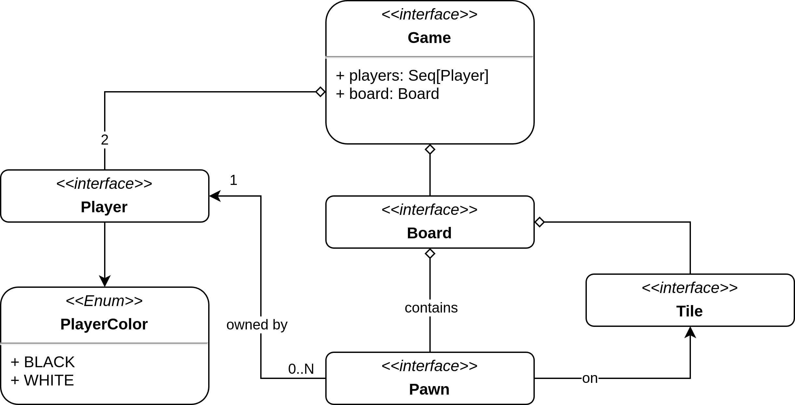

# Requisiti

## Business

* Creazione di un applicativo che permetta di giocare al gioco Othello implementando tutte le regole ufficiali del gioco da tavolo.
* Il gioco deve essere implementato per essere giocato in 2 giocatori, in modalità hot-seat.

## Modello di dominio

Per la realizzazione del dominio, è stato preso come riferimento il gioco da tavolo originale, con tutte le sue regole ufficiali. 
Di seguito sarà riportata una descrizione più dettagliata del nostro dominio applicativo.

### Tabellone di gioco

Il tabellone di gioco è una griglia composta da 8x8 caselle, per un totale di 64 spazi.
Ogni casella rappresenta un punto in cui i giocatori possono piazzare le loro pedine durante il gioco.
Le caselle sono tutte uguali tra loro e non hanno colori specifici, servendo solo come spazi vuoti in attesa delle pedine dei giocatori.

### Pedine

Le pedine di Othello sono dischi a doppia faccia, di cui un lato è nero e l'altro è bianco.
Durante il gioco, le pedine vengono posizionate sulla scacchiera con uno dei due lati rivolti verso l'alto, rappresentando il colore del giocatore che le ha piazzate.
Quando un giocatore circonda una o più pedine avversarie, queste vengono capovolte, cambiando colore e diventando pedine del giocatore che ha eseguito la mossa.

## Funzionali

### Utente

* L'utente deve poter interagire con l'applicazione tramite un'interfaccia grafica locale.
* L'utente deve poter visualizzare il menu principale all'avvio dell'applicazione.
* L'utente deve poter creare una nuova partita, scegliendo il nome di ogni giocatore e decidendo chi sarà il primo giocatore a iniziare.
* L'utente deve poter vedere il campo di gioco una volta iniziata la partita.
* L'utente deve poter posizionare le pedine iniziali in base alle regole del gioco.
* L'utente deve poter vedere il numero di pedine possedute in ogni momento durante la partita.
* L'utente deve poter visualizzare le pedine avversarie sul campo di gioco.
* L'utente deve poter effettuare il proprio turno sapendo in quale fase si trova.
* L'utente deve poter selezionare una cella valida per posizionare una pedina, se disponibile.
* L'utente deve poter capovolgere le pedine avversarie in base alle regole di cattura.
* L'utente deve poter vedere un indicatore del punteggio attuale di entrambi i giocatori.
* L'utente deve poter vedere un messaggio che indica il turno attuale (chi sta giocando).
* L'utente deve poter vedere quando un giocatore non ha più mosse valide disponibili.
* L'utente deve poter visualizzare il risultato finale della partita e chi ha vinto.
* L'utente deve poter rigiocare una nuova partita immediatamente dopo la fine della precedente.

### Sistema

* Il sistema deve poter gestire più pagine, tra cui il menu principale, la pagina di gioco e la pagina di fine partita.
* Il sistema deve poter creare una nuova partita, inizializzando il campo di gioco e le pedine di entrambi i giocatori.
* Il sistema deve poter gestire il posizionamento iniziale delle pedine secondo le regole del gioco.
* Il sistema deve poter gestire il turno di ogni giocatore, permettendo di selezionare una casella valida per posizionare una pedina.
* Il sistema deve poter riconoscere la fine del turno di ogni giocatore, passando al giocatore successivo.
* Il sistema deve poter visualizzare il campo di gioco con le pedine di entrambi i giocatori.
* Il sistema deve poter visualizzare il punteggio attuale di ciascun giocatore durante la partita.
* Il sistema deve poter visualizzare le azioni disponibili per il giocatore attivo in base allo stato della partita.
* Il sistema deve poter gestire la cattura delle pedine avversarie, capovolgendole secondo le regole.
* Il sistema deve poter verificare se un giocatore ha esaurito le mosse valide disponibili.
* Il sistema deve poter gestire la fine della partita, controllando quale giocatore ha il punteggio più alto.
* Il sistema deve poter visualizzare il vincitore al termine della partita e fornire un riepilogo dei punteggi finali.

## Non funzionali

* Usabilità: l'interfaccia grafica deve essere semplice e intuitiva.
* Affidabilità: l'applicazione deve essere stabile, evitando crash.
* Documentazione: l'intero progetto deve essere ben documentato, in modo da facilitare la comprensione del codice.
* Performance: l'applicazione deve essere veloce e reattiva, evitando prolungate attese per l'utente nello svolgimento delle azioni.
* Portabilità: l'applicazione deve essere disponibile su più piattaforme.

## Implementazione

Utilizzo di:

* Scala 3.3.0
* ScalaTest 3.3.x
* JDK 17+
* ScalaFX 20.0.0-R31

## Requisiti Opzionali:

* Gioco contro IA: implementazione di un algoritmo basato su un game tree per consentire all'utente di sfidare un'intelligenza artificiale, che analizzerà le possibili mosse fino a una certa profondità per scegliere la mossa ottimale.
* Salvataggio dello stato del gioco: implementazione del salvataggio/caricamento dello stato di una partita.