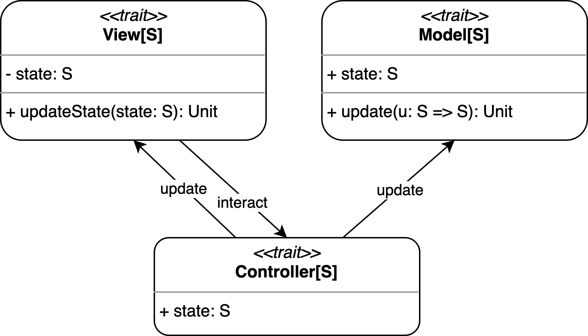

# Design Architetturale

Come pattern architetturale viene utilizzando il pattern MVC (Model-View-Controller), che permette di separare la logica di business dalla logica di presentazione. In questo modo è possibile modificare l'interfaccia grafica senza dover modificare la logica di business e viceversa.

L'architettura scelta è composta da tre componenti principali:

* **Model**: contiene la logica di business dell'applicazione, ovvero le classi che implementano le regole del gioco e che permettono di gestire il suo svolgimento.
Il tutto è però incapsulato all'interno di uno **State** che rappresenta lo stato attuale dell'applicazione, unico elemento all'interno del Model.
Essendo lo stato progettato per essere immutabile, permette di renderlo accessibile all'esterno.
L'unico modo per modificarlo è tramite la funzione `update` che prende in input una funzione di aggiornamento e sostituisce lo stato attuale con quello nuovo, ottenuto applicando la funzione di aggiornamento allo stato attuale.

* **Controller**: contiene le entità che permettono di gestire le interazioni dell'utente con l'applicazione, ovvero quelle che implementano la logica di presentazione e di accesso al Model.
Esse sono le uniche che possono modificare lo stato dell'applicazione richiamando la funzione `update` del Model.
I Controller ricevono interazioni da parte della View e una volta modificato lo stato notificano la View del cambiamento, in modo che essa possa aggiornare l'interfaccia grafica per rispecchiare il nuovo stato.

* **View**: contiene le entità che permettono di visualizzare lo stato dell'applicazione all'utente e che ne permettono l'interazione diretta tramite un interfaccia grafica.
Anche le View hanno al loro interno lo stato dell'applicazione, mantenuto aggiornato dai rispettivi Controller.