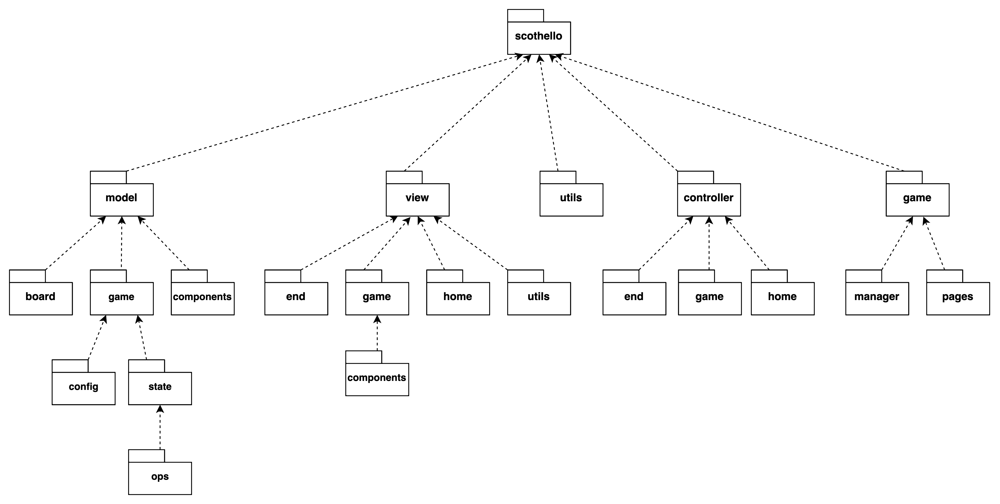
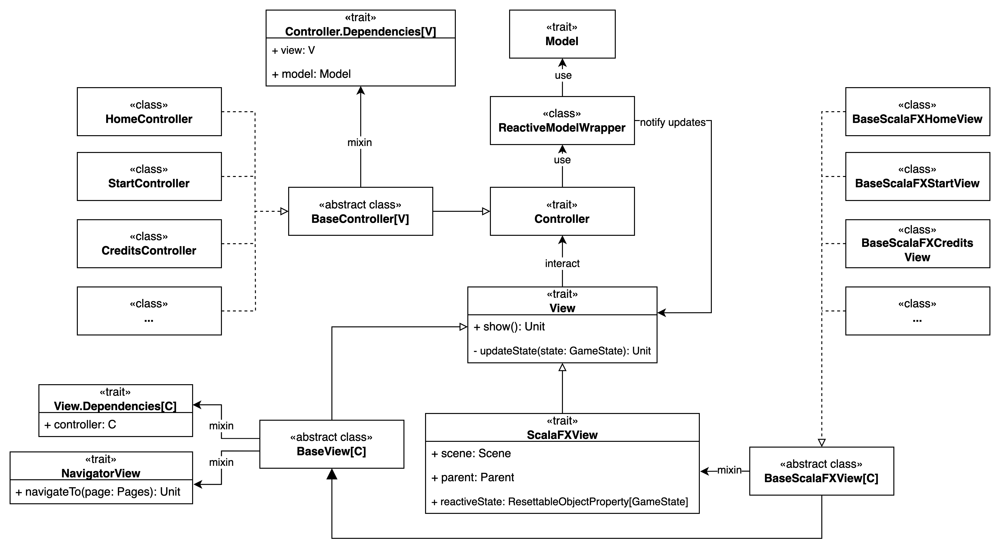

# Design di dettaglio
{: .no_toc }

## Table of Contents
{: .no_toc .text-delta }

1. TOC
{:toc}

## Organizzazione del codice

Il codice è organizzato in 5 package principali:
* `model` contiene le classi che implementano le regole del gioco e che permettono di gestire il suo svolgimento.
* `view` contiene le classi che permettono di visualizzare lo stato dell'applicazione all'utente e che ne permettono l'interazione diretta tramite un interfaccia grafica.
* `controller` contiene le entità che permettono di gestire le interazioni dell'utente con l'applicazione, ovvero quelle che implementano la logica di presentazione e di accesso al Model.
* `utils` contiene classi di utilità.
* `game` contiene le classi che gestiscono il gioco, inclusa la definizione dell'applicazione JFXApp da visualizzare.

## Architettura

### Model
Il Model consiste nello stato dell'applicazione, che viene modificato tramite l'applicazione di una funzione di update.
Lo stato che viene esposto è quindi sempre un oggetto immutabile, permettendone la condivisione tra le varie componenti dell'applicazione.

### Controller

### View

### Game