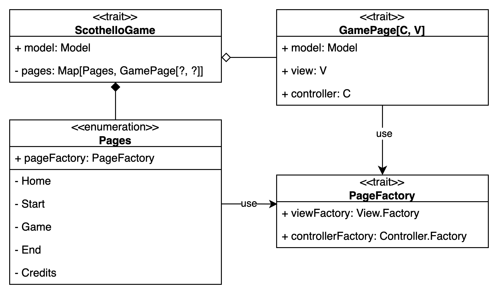
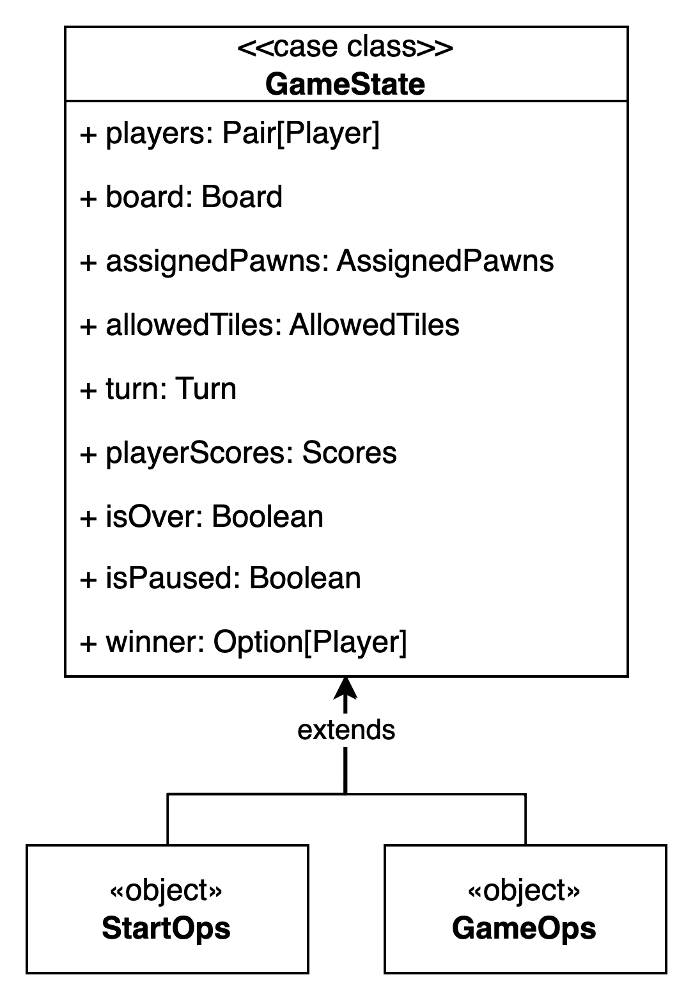
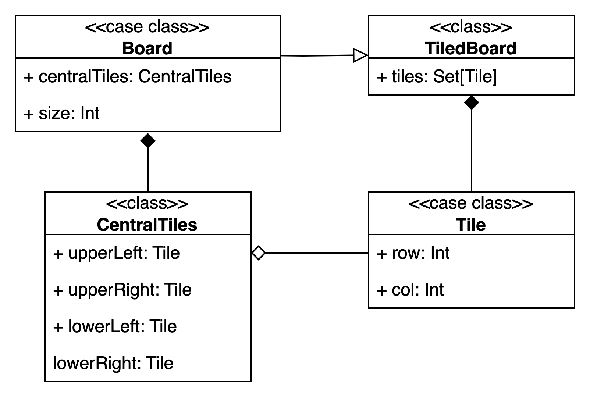

# Design di dettaglio
{: .no_toc }

## Table of Contents
{: .no_toc .text-delta }

1. TOC
{:toc}

## Organizzazione del codice

Il codice è organizzato in 5 package principali:
* `model` contiene le classi che implementano le regole del gioco e che permettono di gestire il suo svolgimento.
* `view` contiene le classi che permettono di visualizzare lo stato dell'applicazione all'utente e che ne permettono l'interazione diretta tramite un interfaccia grafica.
* `controller` contiene le entità che permettono di gestire le interazioni dell'utente con l'applicazione, ovvero quelle che implementano la logica di presentazione e di accesso al Model.
* `utils` contiene classi di utilità.
* `game` contiene le classi che gestiscono il gioco, inclusa la definizione dell'applicazione JFXApp da visualizzare.

## Architettura

### Model
Il Model consiste nello stato dell'applicazione, che viene modificato tramite l'applicazione di una funzione di update.
Lo stato che viene esposto è quindi sempre un oggetto immutabile, permettendone la condivisione tra le varie componenti dell'applicazione.

### Controller
L'elemento del controller è costituito dai singoli package che gesticono ciascuna delle pagine che vengono 
visualizzate durante l'esecuzione del gioco, nello specifico:
* `home`: contiene i controller per la pagina iniziale, dei crediti e di inizio gioco.
* `game`: contiene il controller che gestisce le operazioni riguardanti l'esecuzione di una partita, dall'inizio
alla fine.
* `end`: contiene il controller per la pagina finale, a partita finita.

L'aggiornamento dello stato della view avviene automaticamente grazie a `ReactiveModelWrapper`, che funge da
intermediario incapsulando il model e notificando la view ogni volta che lo stato subisce una modifica.

La struttura del Controller è ispirata al _Cake Pattern_, al fine di rendere la composizione di moduli flessibile e garantire una chiara separazione delle responsabilità tra i componenti dell'applicazione.

### View
Nella View vengono sfruttati i Mixin, in particolare per supportare la navigabilità tra le varie pagine di gioco e per l'integrazione di ScalaFX.
Il Mixin `ScalaFXView` si occupa di gestire la funzionalità di _show_, mentre il Mixin `NavigatorView` si occupa di gestire la navigazione tra le varie pagine di gioco.

Inoltre la `ScalaFXView` espone anche uno stato reattivo che può essere utilizzato nelle varie View e tenuto sempre aggiornato a ogni modifica propagata dal Controller.
Questo rende semplice lo sviluppo delle views, in quanto tutto quello che viene mostrato graficamente è dipendente dallo stato reattivo e viene aggiornato automaticamente.

### Game

Per completare la gestione di MVC è presente il componente `GamePage`, ovvero l'istanza di una pagina di gioco che consiste nella referenza del Model, del Controller e della View.
Questo componente serve per costruire insieme le tre componenti del pattern MVC e collegarle tra loro.

`Pages` è un enum che rappresenta le pagine del gioco, ciascuna associata a una `PageFactory` per creare la vista e il controller corrispondenti.
Il componente responsabile della gestione di queste pagine è `ScothelloGame` che gestisce il mapping delle `Pages` all'istanza di `GamePage` corrispondente.

## Stato della partita
Lo stato della partita è rappresentato dall'entità `GameState`, che raccoglie tutte le informazioni necessarie per rappresentare lo stato di una partita di **Scothello**.
Questa entità funge da nucleo centrale per la gestione dello stato del gioco e include i seguenti elementi:
* **Lista dei giocatori**: i partecipanti alla partita.
* **Tavola di gioco**: rappresentazione del tabellone.
* **Lista di pedine assegnate a ciascun giocatore**: distribuzione delle pedine tra i giocatori.
* **Lista delle caselle disponibili per il giocatore di turno**: posizioni in cui il giocatore corrente può collocare una pedina.
* **Turno corrente**: il giocatore attivo nella partita.
* **Punteggio di ciascun giocatore**: numero di pedine controllate da ogni giocatore.
* **Stato della partita**: flag che indica se la partita è terminata.
* **Modalità pausa**: flag che specifica se la partita è in pausa.
* **Vincitore della partita**: eventuale riferimento al giocatore vincitore (se la partita è conclusa).

### Operations
Le modifiche al `GameState` avvengono attraverso un insieme di operazioni specifiche, progettate per aggiornare lo stato in base alle azioni del giocatore o al flusso di gioco.
Le operazioni sono suddivise in due gruppi principali, `StartOps` e `GameOps`, che gestiscono rispettivamente l'inizializzazione della partita e le azioni durante il suo svolgimento.

Un aspetto fondamentale di queste operazioni è che ogni modifica allo stato del gioco restituisce una nuova istanza di `GameState`, preservando l'immutabilità dello stato. 
Questo approccio evita effetti collaterali indesiderati, garantendo che lo stato precedente non venga mai alterato direttamente, ma invece "copiato" e modificato in modo controllato.

#### StartOps
`StartOps` si occupa dell'inizializzazione di una nuova partita.
Le operazione al suo interno sono responsabili della configurazione iniziale del gioco, come ad esempio l'assegnazione delle pedine iniziali e il setup del turno iniziale.

#### GameOps
`GameOps` gestisce le operazioni che avvengono durante il corso della partita.
Alcune delle operazioni incluse in `GameOps` sono:
* `nextTurn`: avanza la partita al turno successivo.
* `placePawn`: permette al giocatore di posizione una pedina in una casella del tabellone.
* `pauseGame` e `resumeGame`: permettono di mettere in pausa e riprendere la partita.
* `endGame`: termina la partita, determinando il vincitore.

## Tavola di gioco

La tavola di gioco, rappresentata dall'entità `Board`, è composta da una griglia di caselle, rappresentata dall'entità `Tile`, ciascuna con coordinate che determinano la sua posizione. 
Ogni casella può contenere una sola pedina per giocatore. Quest'ultime sono legate a un colore e vengono posizionate sulle caselle della tavola seguendo le regole del gioco.

### Struttura della tavola
Per rendere la tavola di gioco generica e riutilizzabile, è stata definita la classe generica `TiledBoard`. 
Quest'ultima definisce una griglia di caselle, ma non specifica la logica di gioco.
La `Board` è una specializzazione della `TiledBoard` con una griglia 8x8, specifica per il gioco Scothello.
