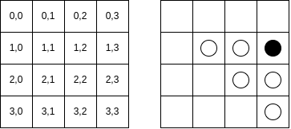
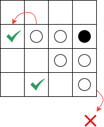

# Implementazione
{: .no_toc }

## Table of Contents
{: .no_toc .text-delta }

1. TOC
{:toc}


## Francesco Ercolani
Il mio contributo nello sviluppo del progetto _Scothello_ riguarda le seguenti parti:

* Realizzazione aspetti di graphic user interface:
  * organizzazione in fogli di stile della view
  * scelta e uniformazione aspetti di stile/design generale delle pagine
  * creazione pagina di inizio partita
  * creazione pagina crediti

* Implementazione della logica di gioco:
  * gestione turno
  * algoritmo posizioni permesse e flip pedine
  * sistema di notifica
  * fine partita

Per quanto riguarda invece le parti per le quali il mio contributo è stato parziale e/o complementare,
figurano le seguenti parti:
 
* Setup iniziale della repository
* Integrazione MVC con ScalaFX
* Situazioni di refactor

### Realizzazione aspetti di graphic user interface

Per sfruttare appieno l'elasticità di ScalaFX e per rendere lo stile generale del gioco uniforme, mantenendo
quindi colori, forme e dimensioni degli elementi comuni alle varie pagine, ho optato per l'utilizzo dei fogli 
di stile.

All'interno del package `resources` troviamo:
* `imgs`: contenente le immagini di background delle singole pagine e i loghi utilizzati
* `styles`: contente i file css 

Il meccanismo utilizzato per avere uno stile uniforme per elementi come i bottoni o i text field
mantenendo la possibilità di modificare determinate caratteristiche specifiche in contesti separati dalle 
pagine, consiste nella creazione di un file css `rootstyle.css` che detta le caratteristiche generali, e una serie 
di css (uno per pagina) che descrivono gli elementi di stile più specifici.

L'object `ScothelloFXApp` è l'entry point dell'applicazione grafica in quanto estende `JFXApp3`. 
Al suo interno avviene la creazione dello `Stage` primario che contiene la `rootScene`.
È proprio a quest'ultima  che viene assegnato il css di definizione dello stile generale. Di seguito 
vediamo come:

```scala
lazy val rootScene: Scene = new Scene:
  root = new Pane()
  stylesheets = List(getClass.getResource("/styles/rootstyle.css").toExternalForm)

override def start(): Unit =
  stage = new JFXApp3.PrimaryStage:
    title = "Scothello"
    scene = rootScene
    width = 1000
    height = 1000
    resizable = false
  postInitAction()
```

Seguendo quindi questo meccanismo di assegnazione dei fogli di stile alle varie schermate è stato mio compito 
quello di far sì che gli elementi fossero predisposti in modo coerente e adottassero uno stile adatto
al contesto dell'applicazione.

Mi sono occupato della creazione della pagina di crediti `CreditsView`, nella quale attraverso una transizione di scorrimento testo 
dal basso verso l'alto si mostrano i componenti del team, e della pagina di inizio partita `StartView` nella quale vengono
inseriti i nickname dei due partecipanti e alla pressione del tasto _start_ viene iniziata la partita.
Vediamo quest'ultimo passaggio per chiarire il meccanismo:
```scala
trait StartView extends View

object StartView:
  def apply(scene: Scene, requirements: View.Requirements[StartController]): StartView =
    BaseScalaFXStartView(scene, requirements)

private class BaseScalaFXStartView(mainScene: Scene, requirements: View.Requirements[StartController])
    extends BaseScalaFXView(mainScene, requirements)
    with StartView:

  override def parent: Parent = new VBox:
    spacing = 30
    alignment = Center
    stylesheets = List(getClass.getResource("/styles/startpage.css").toExternalForm)
    
            ...

    if validInput then
            controller.startGame((player1Name, player2Name))
    navigateToGamePage()
            ...

```

Così come tutte le altre pagine, quest'ultima è associata al rispettivo controller, e grazie al meccanismo
ispirato al cake pattern è possibile chiamare l'operazione `startgame` su controller.
Quest'ultima aggiorna il model assegnando i nickname ai player come valori dello stato:

```scala
/** Controller for the home page */
trait StartController extends Controller:

  /** Starts the game
    *
    * @param usernames
    *   the usernames of the players
    */
  def startGame(usernames: Pair[String]): Unit

object StartController:

  def apply(requirements: Controller.Requirements[StartView]): StartController =
    StartControllerImpl(requirements)

private class StartControllerImpl(requirements: Controller.Requirements[StartView])
    extends BaseController(requirements)
    with StartController:

  override def startGame(usernames: Pair[String]): Unit =
    this.model.update(_ => StartOps.startGame(usernames))
```

Vediamo l'implementazione dell'operazione in `StartOps`
```scala
def startGame(usernames: Pair[String]): GameState =
  val state = GameState()
  val players: Pair[Player] = Pair(
    Player(usernames._1, PlayerColor.Black),
    Player(usernames._2, PlayerColor.White)
  )
  val initialAssignedPawns: AssignedPawns =
    AssignedPawns.initial(players, state.board.centralTiles)

  TurnManager(players)

  state.copy(
    players = players,
    assignedPawns = initialAssignedPawns,
    allowedTiles = AllowedTiles.initial(players._1, initialAssignedPawns),
    turn = TurnManager.initialTurn,
    playerScores = Scores.calculateScores(initialAssignedPawns)
  )
```

### Implementazione della logica di gioco

Il contributo maggiore che ho portato al progetto è stato quello riguardante lo sviluppo delle funzionalità
core del gioco _Othello_. Le operazioni che il gioco deve gestire sono:
* Gestione del turno
* Calcolo delle mosse disponibili per il player che detiene il turno
* Posizionamento di una pedina
* Flip delle pedine "catturate"
* Gestione fine/pausa/ripresa partita

Tale operazioni sono state implementate all'interno di `GameOps`. Ciascuna di essa viene chiamata attraverso
`GameController`.

Un'operazione ritorna un `GameState`, ciò significa che il model prende uno stato e ritorna una stato,
aggiornandolo così di conseguenza. 

Vediamo come esempio l'operazione `calculateAllowedPos` che si occupa del calcolo delle posizioni all'interno
della board nelle quali un player può piazzare una pedina del suo colore:

```scala
def calculateAllowedPos(): GameState =
  state.copy(
    allowedTiles = AllowedTiles.calculate(state.turn.player, state.assignedPawns)
  )
```

Tale funzione ritorna uno stato con `allowedTiles` aggiornato attraverso la funzione `calculate` dell'object 
`AllowedTiles`. La calculate prende in ingresso il player che detiene il turno e la situazione delle pedine
attuale sulla board (`assignedPawns`), applicando l'algoritmo di calcolo delle posizioni nelle quali è 
possibile piazzare pedina.

Il GameState ritornato viene quindi passato alla funzione `update` di `model`

```scala
override def calculateAllowedPos(): Unit =
  this.model.update(_.calculateAllowedPos())
```

Vediamo nel dettaglio `update`:

```scala
override def update(u: GameState => GameState): Unit = _state = u(_state)
```

Di seguito darò una breve descrizione dell'algoritmo che ho pensato e reputato essere il più efficace per
la nostra struttura applicativa. Prendiamo come esempio una griglia 4x4 per semplicità e la seguente 
situazione di gioco (a destra):

L'algoritmo prende in esame le pedine del player che detiene il turno (in questo caso il nero) e per ognuna di
essa controlla le pedine avversarie adiacenti. Per ogni pedina avversaria adiacente viene calcolata quella
che ho rinominato come "new position", ovvero il risultato del seguente calcolo:



```scala
val newRow = opponentTile.row - (playerTile.row - opponentTile.row)
val newCol = opponentTile.col - (playerTile.col - opponentTile.col)
```

Questo calcolo permette di scorrere lungo l'asse della pedina avversaria adiacente per controllare se la 
nuova posizione sia vuota, occupata da un'altra pedina (bianca o nera) o inesistente. Osserviamo nella 
seguente immagine le nuove posizioni generate:


* La pedina bianca in posizione (1,2) genera la nuova posizione (1,1)
* La pedina bianca in posizione (2,2) genera la nuova posizione (3,1)
* La pedina bianca in posizione (2,3) genera la nuova posizione (3,3)
 
A questo punto, la posizione (3,1) è accettata in quanto vuota, e viene quindi inserita tra le posizioni permesse.
Le altre due invece sono occupate da altre pedine bianche e questo fa richiamare il calcolo della nuova posizione
per entrambe ricorsivamente finché non si arriva a una posizione accettata (vuota) o non (pedina nera o fuori dalla
griglia).



Vediamo il codice della funzione *tail recursive*:

```scala
 @tailrec
  private def calculateNewPosition(
      playerTile: Tile,
      opponentTile: Tile,
      player: Player,
      assignedPawns: AssignedPawns
  ): Option[Tile] =
    val newRow = opponentTile.row - (playerTile.row - opponentTile.row)
    val newCol = opponentTile.col - (playerTile.col - opponentTile.col)

    if newRow >= 0 && newRow < 8 && newCol >= 0 && newCol < 8 then
      val newTile = Tile(newRow, newCol)
      assignedPawns.get(newTile) match
        case Some(pawn) if pawn.player != player =>
          flips += opponentTile
          calculateNewPosition(opponentTile, newTile, player, assignedPawns)
        case None =>
          flips += opponentTile
          flipsMap.get(newTile) match
            case Some(existingFlips) =>
              existingFlips ++= flips
            case None =>
              flipsMap += (newTile -> flips.clone())

          Some(newTile)
        case _ =>
          None
    else None
```

L'algoritmo sfrutta inoltre questo processing per memorizzare tutte le posizioni delle pedine che subiranno
il flip nel caso in cui verrà scelta quella specifica posizione permessa.

Tutte le operazioni di gioco sono state testate, in particolare all'interno di `BoardTest` ho voluto simulare
l'esecuzione di una partita controllando step per step che venisse tutto eseguito correttamente. Vediamo un
esempio:

```scala
it should "calculate allowed tiles after a move is made" in {
  val assignedPawns = createInitialAssignedPawns() + (Tile(2, 3) -> Pawn(twoPlayers._1))
  val allowedTiles = AllowedTiles.calculate(twoPlayers._2, assignedPawns)
  val expectedTiles = Set(
    Tile(1, 3),
    Tile(2, 4),
    Tile(3, 5),
    Tile(4, 2),
    Tile(5, 3)
  )
```

### Contributo parziale e/o complementare
Ho apportato contributo congiuntamente al mio compagno di lavoro sia per quanto riguarda il setup delle repository,
relativamente alla gestione delle actions e della struttura del progetto, che riguardo alla strutturazione MVC
generale.

`GameView` si è deciso di organizzarla nel modo più modulare possibile attraverso il meccanismo delle
_given instances_:

```scala
 override def parent: Parent = new VBox:
    stylesheets = List(getClass.getResource("/styles/gamepage.css").toExternalForm)

    given displayScene: Scene = mainScene
    given clickHandler: GameViewClickHandler = GameViewClickHandler(controller)
    given gameController: GameController = requirements.controller

    val headerHeight: Double = mainScene.height.value / 8
    val notificationsBarHeight: Double = mainScene.height.value / 24

    val header: HBox =
      HeaderComponent.headerComponent(reactiveState, headerHeight)
    val notificationsBar: HBox =
      NotificationsBarComponent.notificationsBarComponent(reactiveState, notificationsBarHeight)
    val board: HBox =
      BoardComponent.boardComponent(reactiveState, headerHeight, notificationsBarHeight)
    val stopButton: HBox =
      StopButtonComponent.stopButtonComponent(reactiveState)

    children.addAll(header, notificationsBar, board, stopButton)
```
## Enrico Lumini