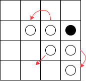

# Implementazione
{: .no_toc }

## Table of Contents
{: .no_toc .text-delta }

1. TOC
{:toc}


## Francesco Ercolani
Il mio contributo nello sviluppo del progetto _Scothello_ riguarda le seguenti parti:

* Creazione e implementazione algoritmo posizioni permesse e flip pedine
* Gestione del turno di gioco
* Creazione pagina di inizio partita
* Creazione pagina crediti
* Implementazione gestione mosse non disponibili
* Organizzazione in fogli di stile della view
* Scelta e uniformazione aspetti di stile/design generale delle pagine

### Algoritmo posizioni permesse

Di seguito darò una breve descrizione dell'algoritmo che ho pensato e reputato essere il più efficace per
la nostra struttura applicativa. Prendiamo come esempio una griglia 4x4 per semplicità e la seguente 
situazione di gioco (a destra):


L'algoritmo prende in esame le pedine del player che detiene il turno (in questo caso il nero) e per ognuna di
essa controlla le pedine avversarie adiacenti. Per ogni pedina avversaria adiacente viene calcolata quella
che ho rinominato come "new position", ovvero il risultato del seguente calcolo:

```scala
val newRow = opponentTile.row - (playerTile.row - opponentTile.row)
val newCol = opponentTile.col - (playerTile.col - opponentTile.col)
```

Questo calcolo permette di scorrere lungo l'asse della pedina avversaria adiacente per controllare se la 
nuova posizione sia vuota, occupata da un'altra pedina (bianca o nera) o inesistente. Osserviamo nella 
seguente immagine le nuove posizioni generate:



* La pedina bianca in posizione (1,2) genera la nuova posizione (1,1)
* La pedina bianca in posizione (2,2) genera la nuova posizione (3,1)
* La pedina bianca in posizione (2,3) genera la nuova posizione (3,3)
 
A questo punto, la posizione (3,1) è accettata in quanto vuota, e viene quindi inserita tra le posizioni permesse.
Le altre due invece sono occupate da altre pedine bianche e questo fa richiamare il calcolo della nuova posizione
per entrambe ricorsivamente finché non si arriva a una posizione accettata (vuota) o non (pedina nera o fuori dalla
griglia).


Vediamo il codice della funzione *tail recursive*:

```scala
 @tailrec
  private def calculateNewPosition(
      playerTile: Tile,
      opponentTile: Tile,
      player: Player,
      assignedPawns: AssignedPawns
  ): Option[Tile] =
    val newRow = opponentTile.row - (playerTile.row - opponentTile.row)
    val newCol = opponentTile.col - (playerTile.col - opponentTile.col)

    if newRow >= 0 && newRow < 8 && newCol >= 0 && newCol < 8 then
      val newTile = Tile(newRow, newCol)
      assignedPawns.get(newTile) match
        case Some(pawn) if pawn.player != player =>
          flips += opponentTile
          calculateNewPosition(opponentTile, newTile, player, assignedPawns)
        case None =>
          flips += opponentTile
          flipsMap.get(newTile) match
            case Some(existingFlips) =>
              existingFlips ++= flips
            case None =>
              flipsMap += (newTile -> flips.clone())

          Some(newTile)
        case _ =>
          None
    else None
```
### Algoritmo flip pedine

L'algoritmo sfrutta inoltre questo processing per memorizzare tutte le posizioni delle pedine, all'interno
della struttura `flipsMap`, che subiranno  il flip nel caso in cui verrà scelta quella specifica posizione permessa.

```scala
def flipPawns(tile: Tile): GameState =
  val array = AllowedTiles.flipsMap.getOrElse(tile, ArrayBuffer.empty[Tile])

  val newAssignedPawns: AssignedPawns = state.assignedPawns.collect {
    case (t, pawn) if array.contains(t) =>
      t -> Pawn(state.turn.player)
    case (t, pawn) =>
      t -> pawn
  }

  AllowedTiles.resetMap()
  state.copy(
    assignedPawns = newAssignedPawns,
    playerScores = Scores.calculateScores(newAssignedPawns)
  )
```

Viene creata una nuova mappa delle pedine `newAssignedPawns` applicando un pattern-matching per aggiornare solo quelle coinvolte, 
lasciando intatte le altre. Infine, aggiorna lo stato di gioco ritornando un nuovo `GameState` con le pedine aggiornate e 
i punteggi ricalcolati.

### Realizzazione aspetti di graphic user interface

Per sfruttare appieno l'elasticità di ScalaFX e per rendere lo stile generale del gioco uniforme, mantenendo
quindi colori, forme e dimensioni degli elementi comuni alle varie pagine, ho optato per l'utilizzo dei fogli
di stile.

All'interno del package `resources` troviamo:
* `imgs`: contenente le immagini di background delle singole pagine e i loghi utilizzati
* `styles`: contente i file css

Il meccanismo utilizzato per avere uno stile uniforme per elementi come i bottoni o i text field
mantenendo la possibilità di modificare determinate caratteristiche specifiche in contesti separati dalle
pagine, consiste nella creazione di un file css `rootstyle.css` che detta le caratteristiche generali, e una serie
di css (uno per pagina) che descrivono gli elementi di stile più specifici.

L'object `ScothelloFXApp` è l'entry point dell'applicazione grafica in quanto estende `JFXApp3`.
Al suo interno avviene la creazione dello `Stage` primario che contiene la `rootScene`.
È proprio a quest'ultima  che viene assegnato il css di definizione dello stile generale. Di seguito
vediamo come:

```scala
lazy val rootScene: Scene = new Scene:
  root = new Pane()
  stylesheets = List(getClass.getResource("/styles/rootstyle.css").toExternalForm)

override def start(): Unit =
  stage = new JFXApp3.PrimaryStage:
    title = "Scothello"
    scene = rootScene
    width = 1000
    height = 1000
    resizable = false
  postInitAction()
```

Seguendo quindi questo meccanismo di assegnazione dei fogli di stile alle varie schermate è stato mio compito
quello di far sì che gli elementi fossero predisposti in modo coerente e adottassero uno stile adatto
al contesto dell'applicazione.

Mi sono occupato della creazione della pagina di crediti `CreditsView`, nella quale attraverso una transizione di scorrimento testo
dal basso verso l'alto si mostrano i componenti del team, e della pagina di inizio partita `StartView` nella quale vengono
inseriti i nickname dei due partecipanti e alla pressione del tasto _start_ viene iniziata la partita.
```scala
trait StartView extends View

object StartView:
  def apply(scene: Scene, requirements: View.Requirements[StartController]): StartView =
    BaseScalaFXStartView(scene, requirements)

private class BaseScalaFXStartView(mainScene: Scene, requirements: View.Requirements[StartController])
    extends BaseScalaFXView(mainScene, requirements)
    with StartView:

  override def parent: Parent = new VBox:
    spacing = 30
    alignment = Center
    stylesheets = List(getClass.getResource("/styles/startpage.css").toExternalForm)
    
    // stuff
```

### Contributo parziale e/o complementare
Ho apportato contributo congiuntamente al mio compagno di lavoro sia per quanto riguarda il setup delle repository,
relativamente alla gestione delle actions e della struttura del progetto, che riguardo alla strutturazione MVC
generale.

`GameView` si è deciso di organizzarla nel modo più modulare possibile attraverso il meccanismo delle
_given instances_:

```scala
 override def parent: Parent = new VBox:
    stylesheets = List(getClass.getResource("/styles/gamepage.css").toExternalForm)

    given displayScene: Scene = mainScene
    given clickHandler: GameViewClickHandler = GameViewClickHandler(controller)
    given gameController: GameController = requirements.controller

    val headerHeight: Double = mainScene.height.value / 8
    val notificationsBarHeight: Double = mainScene.height.value / 24

    val header: HBox =
      HeaderComponent.headerComponent(reactiveState, headerHeight)
    val notificationsBar: HBox =
      NotificationsBarComponent.notificationsBarComponent(reactiveState, notificationsBarHeight)
    val board: HBox =
      BoardComponent.boardComponent(reactiveState, headerHeight, notificationsBarHeight)
    val stopButton: HBox =
      StopButtonComponent.stopButtonComponent(reactiveState)

    children.addAll(header, notificationsBar, board, stopButton)
```


## Enrico Lumini
Il mio contributo nello sviluppo del progetto _Scothello_ riguarda le seguenti parti:

* Creazione dell'architettura MVC
* Modellazione dello stato della partita e implementazione di parte dei componenti relativi a quest'ultimo:
  * Player
  * Board
  * AssignedPawns
  * Turn
  * Scores
* Creazione della pagina di gioco
* Implementazione del timer
* Implementazione conteggio del punteggio
* Implementazione azioni di pausa/ripristino e fine partita

### MVC
L'architettura MVC è inspirata al Cake Pattern, si può notare infatti come ognuno dei tre componenti abbia ad esempio il concetto di dipendenza, gestite tramite un Mixin che trasforma i requirements in proprietà del componente.

#### Controller
Il Controller ha come dipendenze sia il Model che la View, in modo da poterli utilizzare all'interno del controller stesso.
```scala
trait Controller:
  def state: GameState

object Controller:
  trait Requirements[V <: View] extends Model.Provider with View.Provider[V]

  trait Dependencies[V <: View](requirements: Requirements[V]) extends Controller:
    protected def view: V = requirements.view
    protected def model: Model = requirements.model

  trait Provider[C <: Controller]:
    def controller: C
```
Per gestire gli update della view in maniera automatica è presente un `ReactiveModelWrapper` che incapsula il vero Model e si occupa di aggiornare la View ogni volta che lo stato del model cambia.
```scala
class ReactiveModelWrapper(view: => View, model: Model) extends Model:
  private val internalModel = model
  override def state: GameState = internalModel.state
  override def update(u: GameState => GameState): Unit =
    internalModel.update(u)
    view.updateState(internalModel.state)
```
Questo permette la creazione di un controller Base che supporta automaticamente l'aggiornamento della rispettiva View.
```scala
abstract class BaseController[V <: View](
    requirements: Controller.Requirements[V]
) extends Controller
    with Controller.Dependencies(requirements):

  override def state: GameState = model.state
  override val model: Model =
    new ReactiveModelWrapper(view, requirements.model)
```

#### View
Anche il concetto di View è strutturato seguendo la stessa logica del Controller, infatti anch'essa presenta le sue dipendenze, che in questo caso consistono solamente nel Controller.
```scala
trait View:
  // stuff

object View:
  trait Requirements[C <: Controller] extends Controller.Provider[C]
  
  trait Dependencies[C <: Controller](requirements: Requirements[C]) extends View:
    protected def controller: C = requirements.controller
  
  trait Provider[V <: View]:
    def view: V
```
Per supportare la navigabilità tra le varie View, è presente un Mixin denominato `NavigatorView` che estende `View` aggiungendo il metodo `navigateTo`, il quale permette di navigare a una determinata pagina.
```scala
trait NavigatorView extends View:
  def navigateTo(page: Pages): Unit = ScothelloGameManager.navigateTo(page)
```
Per supportare inoltre l'integrazione dell'architettura con ScalaFX, è presente un ulteriore Mixin, `ScalaFXView`, che aggiunge la proprietà `parent` che costituisce il nodo radice della View e che verrà poi implementato dalle view concrete.
Questo componente inoltre si occupa di esporre lo stato reattivo in modo da poter essere sfruttato dagli elementi grafici poiché mantenuto sempre sincronizzato.
```scala
trait ScalaFXView(
    val scene: Scene
) extends View:

  def reactiveState: ResettableObjectProperty[GameState]

  def parent: Parent

  override def show(): Unit =
    scene.root = parent
```
La reattività viene implementata utilizzando la proprietà `ObjectProperty` di ScalaFX, che permette di osservare i cambiamenti di un valore generico e di reagire a essi in maniera automatica.
In particolare viene incapsulato lo stato del gioco all'interno di una `ObjectProperty` in modo che ogni volta che quest'ultimo cambia, la View venga aggiornata automaticamente.
```scala
abstract class BaseScalaFXView[C <: Controller](
    scene: Scene,
    requirements: View.Requirements[C]
) extends BaseView[C](requirements)
    with ScalaFXView(scene):

  private val _reactiveState: ResettableObjectProperty[GameState] = ResettableObjectProperty(controller.state)

  // stuff

  override def updateState(state: GameState): Unit =
    super.updateState(state)
    _reactiveState() = state
```
Per risolvere alcuni problemi legati alla gestione dei listener al momento della creazione di una nuova partita, è stata creata la classe `ResettableObjectProperty`, estensione della classe `ObjectProperty`, che permette di eliminare tutti i listener registrati sullo stato reattivo.
```scala
class ResettableObjectProperty[T](initialValue: T) extends ObjectProperty[T](new SimpleObjectProperty[T](initialValue)):

  private var subscriptions: List[Subscription] = List.empty
  private var derivedProperties: List[ResettableObjectProperty[_]] = List.empty

  override def onChange[J1 >: T](op: (ObservableValue[T, T], J1, J1) => Unit): Subscription =
    // save onChange subscription inside subscriptions

  def map[R](f: T => R): ResettableObjectProperty[R] =
    // save map derived property inside derivedProperties

  /** Removes all listeners
    */
  def removeListeners(): Unit =
    subscriptions.foreach { subscription =>
      subscription.cancel()
    }
    derivedProperties.foreach(_.removeListeners())
    subscriptions = List.empty
```
#### Game page
La costruzione dei vari componenti viene effettuata all'interno della `GamePage` che è il componente che si occupa di istanziare la view e il rispettivo controller passandogli le dipendenze necessarie.
```scala
trait GamePage[C <: Controller, V <: View](
  override val model: Model,
  val pageFactory: PageFactory[C, V]
) extends Model.Requirements
    with View.Requirements[C]
    with Controller.Requirements[V]:
  override lazy val view: V = pageFactory.viewFactory(this)
  override lazy val controller: C = pageFactory.controllerFactory(this)
```
Quest'ultimo infatti al suo interno contiene tutte le dipendenze richieste da tutti i componenti e sfrutta questa proprietà per fare un'inizializzazione semplice e pulita.

### Modellazione dei componenti della partita
Per modellare lo stato della partita, come prima cosa, sono state individuate e definite le sue componenti principali, ovvero il `Player`, la `Board`, le `AssignedPawn`, le `AllowedTiles`, il `Turn` e gli `Scores`.
L'implementazione delle `AllowedTiles` è stata fatta da [Francesco Ercolani](#francesco-ercolani), in quanto componente essenziale per l'implementazione del suo algoritmo per la gestione della logica di gioco.
Le componenti `AssignedPawn`, `AllowedTiles` e `Scores` sono state implementate sfruttando i **type alias**, in modo da rendere il codice più leggibile.
Di seguito sono riportati due esempi di definizione di **type alias**:
* `AssignedPawns`
  ```scala
  type AssignedPawns = Map[Tile, Pawn]
  
  object AssignedPawns:
    // companion object with utility methods
  ```
* `Scores`
  ```scala
  type Scores = Map[Player, Int]
  
  object Scores:
    // companion object with utility methods
  ```

### Modellazione dello stato della partita
In concomitanza della definizione delle componenti sopra citate, è stata modellata anche l'entità principale dello stato della partita, ovvero il `GameState`.
Quest'ultimo contiene tutte le informazioni necessario per poter catturare i vari snapshot dello stato complessivo della partita durante il suo svolgimento.
```scala
final case class GameState(
    players: Pair[Player],
    board: Board,
    assignedPawns: AssignedPawns,
    allowedTiles: AllowedTiles,
    turn: Turn,
    playerScores: Scores,
    isOver: Boolean,
    isPaused: Boolean,
    winner: Option[Player]
)
```
La class `Pair` è stata definita all'interno del package `utils` e rappresenta una coppia di elementi, in questo caso due `Player`.

### Calcolo del punteggio e definizione del vincitore
Il calcolo del punteggio è stato implementato all'interno della classe `Scores` grazie alla funzione `calculateScores` che prende in input le `AssignedPawns` e restituisce i punteggi dei due giocatori.
```scala
def calculateScores(assignedPawns: AssignedPawns): Scores =
    assignedPawns
      .groupBy(_._2.player)
      .map { case (player, pawns) => player -> pawns.size }
```
La funzione implementata utilizza un approccio funzionale per calcolare i punteggi, sfruttando il metodo `groupBy` di Scala per raggruppare le pedine assegnate per giocatore e il metodo `map` per calcolare il punteggio di ciascun giocatore.
Tale funzione viene richiamata dopo ogni flip delle pedine conseguente al posizionamento di una pedina da parte di un giocatore, in modo da aggiornare i punteggi di quest'ultimi in maniera consistente.
Al momento della fine della partita, il vincitore viene calcolato in base ai punteggi dei due giocatori.
```scala
 private def determineWinner(state: GameState): Option[Player] =
    val (leadingPlayer, maxCount) = state.playerScores.maxBy(_._2)
    if state.playerScores.values.count(_ == maxCount) > 1 then None
    else Some(leadingPlayer)
```
La funzione `determineWinner` individua il giocatore con il punteggio più alto tramite il metodo `maxBy` e verifica se il punteggio massimo è condiviso da più giocatori.
Restituisce `None` in caso di pareggio o il giocatore vincente in caso contrario. 

## Pair programming
Nel corso del progetto, il pair programming si è rivelato un metodo estremamente efficace per migliorare la qualità del lavoro e garantire una collaborazione continua tra i membri del team. 
Questo approccio ci ha permesso di condividere conoscenze e affrontare insieme le sfide più complesse. 
In particolare, abbiamo applicato il pair programming per definire e configurare le pipeline di Continuous Integration, assicurando l'esecuzione automatica dei test e il deployment della documentazione in modo affidabile ed efficiente. 
Inoltre, abbiamo collaborato per integrare l'architettura MVC con ScalaFX, garantendo una separazione ben strutturata delle responsabilità tra Model, View e Controller. 
Infine, questa metodologia ci ha supportato anche durante le sessioni di refactoring, consentendoci di migliorare il codice esistente in termini di leggibilità, manutenibilità e coerenza.